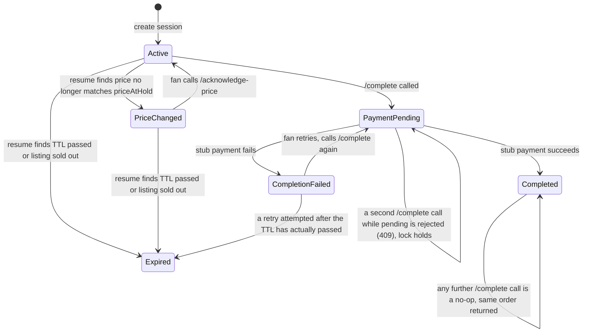

# Showtime

A full ticketing service application — **work in progress.**

The long-term goal is a complete ticketing platform: browse and search
events, hold and complete a purchase with real continuity across devices,
manage saved payment methods, and eventually support real inventory,
payments, and order history. What exists today is an early foundation —
the checkout-continuity flow, event browsing/search, and saved payment
methods are built; everything else in the vision below is still ahead.

## What's built so far

- **Checkout continuity.** A fan creates a ticket checkout session, can
  resume it across web and a simulated mobile deep link, and completes the
  purchase safely — the backend is the single source of truth for session
  state, price changes, expiration, and duplicate-order prevention.
- **Event browsing & search.** A browse page with live search-as-you-type
  over the event catalog.
- **Saved payment methods.** A saved-card select on checkout, plus a
  dedicated flow for adding a new card (client-side validated — card
  issuer detection, Luhn check, expiry, CVC — with only the non-sensitive
  summary of a card, never a full card number or CVC, ever reaching the
  server).

## Stack (current — expect this to change)

Next.js (App Router) + TypeScript + React, in-memory store. Pages are Server
Components; the interactive pieces (countdown, buttons, quantity selector,
search, payment form) are Client Components under `app/components/`. The
JSON API lives in Route Handlers under `app/api/`, and the checkout rules
they call live in `src/server/services/checkoutService.ts`. Jest for tests,
which invoke the Route Handlers directly.

The in-memory store is known-temporary — see Roadmap below.

```bash
npm install
npm run dev            # starts the dev server
```

Then visit `http://localhost:3000` — pick a quantity, click **CONTINUE**,
and you're on the checkout page. Click **Continue on mobile →** to open the
same session on the simulated mobile deep-link surface.

Run the test suite:

```bash
npm test
```

Production build:

```bash
npm run build
npm start
```

**Manual testing helpers** (dev-only, return 404 when `NODE_ENV=production`):
there's no real payment/inventory system to organically fail or change
price, so these routes let you trigger those scenarios by hand instead of
waiting on the real hold window:

```bash
curl -X POST http://localhost:3000/api/debug/listings/lakers-warriors-112-14/price -H 'Content-Type: application/json' -d '{"price": 175}'
curl -X POST http://localhost:3000/api/debug/listings/lakers-warriors-112-14/sold-out
curl -X POST http://localhost:3000/api/debug/listings/lakers-warriors-112-14/reset
curl -X POST http://localhost:3000/api/debug/payment/force-result -H 'Content-Type: application/json' -d '{"succeeds": false}'
```

## The Checkout Session State Model

```ts
type CheckoutSessionStatus =
  | "active"
  | "price_changed"
  | "expired"
  | "payment_pending"
  | "completed"
  | "completion_failed";
```

`expired` covers both a hold's TTL passing and the stub inventory reporting
sold out, disambiguated by an `expiredReason: "ttl" | "inventory"` field
rather than two separate statuses — both are terminal and the client treats
them identically except for the copy shown.



`payment_pending`, `completed`, and `completion_failed` are all immune to
being changed by a resume or page reload — only `/complete` or
`/acknowledge-price` can move a session out of them.

## How Web and Mobile Resume the Same Session

The backend owns all session state in a single in-memory
`Map<string, CheckoutSession>`. Both surfaces' page routes —
`GET /checkout/:id` (web) and `GET /mobile/checkout/:id` (mobile deep link)
— call the exact same shared `resumeSession(session, surface)` function.
Every resume — including a plain page reload — revalidates the session
against the stub inventory/pricing service and updates status accordingly;
the client never decides on its own whether a session is still valid.

`lastResumedSurface` and `completedOnSurface` record which surface actually
touched the session last and which one drove it to completion, so
cross-surface handoff is something you can verify by inspecting session
state.

The mobile deep link itself is just `/mobile/checkout/:id` — no auth on it.
`POST /checkout-sessions` also generates and returns a `resumeToken`,
matching the shape of a real signed, short-lived deep-link token, but
nothing currently validates it (see Known Limitations).

## Handling Stale Inventory, Price Changes, and Duplicate Completion

**Price changes:** `priceAtHold` freezes at session creation; `currentPrice`
is refreshed against the stub listing on every resume. When they diverge
and the fan hasn't acknowledged it, status becomes `price_changed` — the UI
shows the old price struck through next to the new one, and `/complete` is
rejected (`PRICE_CHANGE_UNACKED`) until the fan explicitly calls
`/acknowledge-price`. The total is never silently updated.

**Stale inventory / expiration:** the same resume path checks TTL and stub
availability and flips to `expired` with the appropriate reason.

**Duplicate completion:** `/complete` flips status to `payment_pending`
*synchronously*, before ever awaiting the (stubbed) payment call, so a
second `/complete` call — even one arriving a fraction of a second later —
is guaranteed to see `payment_pending` already set and gets rejected
(`COMPLETION_IN_PROGRESS`) rather than both calls racing past the check.
An already-`completed` session returns the *same* order idempotently rather
than erroring or creating a second one. This is verified with an actual
concurrent-request test (`test/complete.test.ts`) that fires two
`/complete` calls at once and asserts there is never more than one
`orderId`.

`/complete` also independently rechecks the wall clock against `expiresAt`
and the live listing price, rather than only trusting a cached `status`
field — a session could be past its TTL or have a stale price without
having been resumed recently, and both need to be enforced server-side
regardless.

## Known Limitations

- **In-memory store only.** All session/listing/payment-method state is
  lost on restart, and nothing here scales past a single process — see
  Roadmap.
- **`resumeToken` is generated but never validated.** It demonstrates the
  shape of a signed deep-link token without the actual signing/
  verification logic being enforced anywhere yet.
- **State-changing actions require JavaScript.** Page content (price,
  event details, current status) is server-rendered and visible without
  JS, but actions like Complete Purchase don't have a no-JS `<form>`
  fallback.
- **Payment, auth, and inventory are all stubs.** No real payment gateway,
  no real accounts, no real catalog.
- **Saved payment methods are a single global stub list**, not scoped to
  a real account — there's no auth/user model yet.

## Roadmap

- **A real datastore.** Move checkout sessions to Redis (a natural fit —
  sessions already have TTL/expiry semantics) and durable records (orders,
  saved payment methods, accounts) to Postgres, and make the server
  stateless so it can run as more than one instance.
- **Real accounts**, so saved payment methods, order history, and
  preferences are actually scoped to a person instead of a global stub
  list.
- **Real payment/inventory integration** behind the same interfaces the
  stubs use today.
- **Real signing/verification for `resumeToken`.**
- **WebSocket/SSE push** instead of resume-on-reload, so a price change
  appears without the fan needing to refresh.
- **No-JS `<form>` fallbacks** for the state-changing actions, not just
  page content.
- **A real analytics pipeline** behind the instrumentation events already
  being logged (`session_created`, `session_resumed`, `price_changed_shown`,
  `completion_attempted/succeeded/failed`, `duplicate_prevented`,
  `payment_method_added`) — the event shape already exists, it just logs
  to stdout today.
- **Automated browser tests** (e.g. Playwright) as a permanent part of the
  suite.
- Revisit the framework choice (e.g. Next.js) once the data layer above is
  settled, if it's still the right call at that point.
